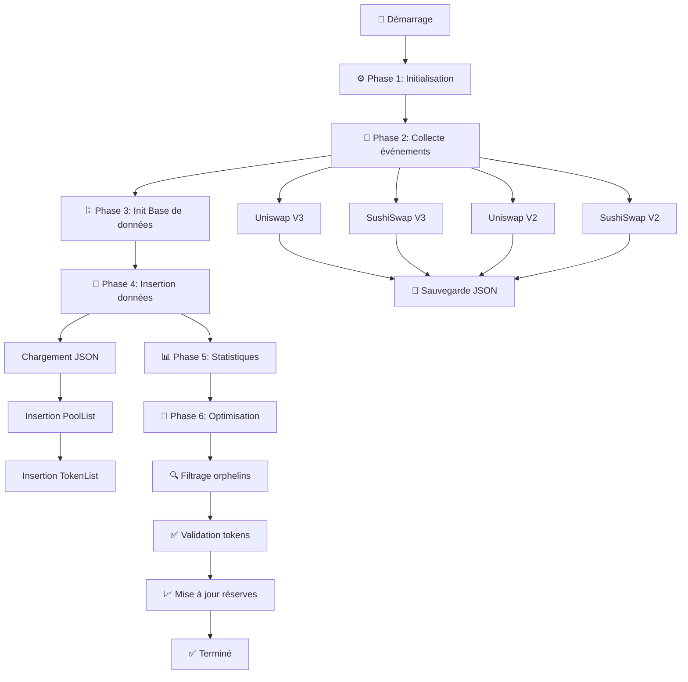

# 🚀 DEFI Financial Arbitrage

Un système d'arbitrage financier DeFi automatisé qui surveille et analyse les opportunités d'arbitrage entre différentes plateformes de trading décentralisées (DEX) sur le réseau Base.

## 📋 Table des matières

- [Vue d'ensemble](#vue-densemble)
- [Flux d'exécution chronologique](#flux-dexécution-chronologique)
- [Détail des fonctions Python](#détail-des-fonctions-python)
- [Architecture](#architecture)
- [Installation](#installation)
- [Configuration](#configuration)
- [Utilisation](#utilisation)
- [Structure du projet](#structure-du-projet)
- [API et dépendances](#api-et-dépendances)
- [Base de données](#base-de-données)
- [DEX supportés](#dex-supportés)
- [Exemples d'utilisation](#exemples-dutilisation)
- [Dépannage](#dépannage)
- [Contribution](#contribution)
- [Licence](#licence)

## 🎯 Vue d'ensemble

Ce projet est un système sophistiqué d'arbitrage DeFi qui :

- **Surveille en temps réel** les événements de création de pools sur les DEX majeurs
- **Collecte et stocke** les données de pools dans une base de données MySQL
- **Analyse les opportunités d'arbitrage** entre Uniswap V2/V3 et SushiSwap V2/V3
- **Filtre les tokens orphelins** pour optimiser les performances
- **Met à jour automatiquement** les réserves et informations des pools

## ⏰ Flux d'exécution chronologique

Le programme suit un processus séquentiel précis en 6 phases principales :

### 🔧 **Phase 1 : Initialisation et Configuration**
```python
# 1.1 Chargement des variables d'environnement
load_dotenv()
API_Keys = os.getenv('Base_API')

# 1.2 Connexion à la blockchain Base
web3 = Web3(Web3.HTTPProvider(f"https://base-mainnet.g.alchemy.com/v2/{API_Keys}"))

# 1.3 Définition des adresses des factories DEX
UniswapV3_factory = "0x33128a8fC17869897dcE68Ed026d694621f6FDfD"
SushiswapV3_factory = "0xc35DADB65012eC5796536bD9864eD8773aBc74C4"
SushiswapV2_factory = "0x71524B4f93c58fcbF659783284E38825f0622859"
UniswapV2_factory = "0x8909Dc15e40173Ff4699343b6eB8132c65e18eC6"
```

### 📡 **Phase 2 : Collecte des événements de création de pools**
Le système parcourt la blockchain par blocs pour récupérer tous les événements de création de pools :

```python
# 2.1 Récupération des pools Uniswap V3
Fetch_EventsPairV3(web3, UniswapV3_factory, "Uniswap").IterateOverBlocks()

# 2.2 Récupération des pools SushiSwap V3  
Fetch_EventsPairV3(web3, SushiswapV3_factory, "Sushiswap").IterateOverBlocks()

# 2.3 Récupération des pools SushiSwap V2
Fetch_EventsPairV2(web3, SushiswapV2_factory, "Sushiswap").IterateOverBlocks()

# 2.4 Récupération des pools Uniswap V2
Fetch_EventsPairV2(web3, UniswapV2_factory, "Uniswap").IterateOverBlocks()
```

**Détail du processus de collecte :**
- Le système vérifie d'abord le dernier bloc traité dans les fichiers JSON
- Il parcourt la blockchain par tranches de 50k-60k blocs pour éviter les limites API
- Pour chaque événement `PoolCreated`/`PairCreated`, il extrait :
  - Adresse du pool
  - Token0 et Token1
  - Frais de trading
  - Numéro de bloc de création
  - Tick spacing (pour V3)
- Les données sont sauvegardées dans des fichiers JSON temporaires

### 🗄️ **Phase 3 : Initialisation de la base de données**
```python
# 3.1 Création de la base de données et des tables
SQL_Init()  # Crée la DB 'mainet' et les tables PoolList/TokenList
```

**Tables créées :**
- `PoolList` : Stockage des informations des pools
- `TokenList` : Stockage des informations des tokens

### 💾 **Phase 4 : Insertion des données dans MySQL**
Le système charge les données JSON et les insère dans la base de données :

```python
# 4.1 Chargement et insertion Uniswap V3
Uniswapv3_ListPools = JsonFile_Data_ListePools.ReturnJsonAsPythonReadable("JSON/UniswapV3.json")
SQL_Pools().Update_Database(Uniswapv3_ListPools, 3)

# 4.2 Chargement et insertion SushiSwap V3
Sushiswapv3_ListPools = JsonFile_Data_ListePools.ReturnJsonAsPythonReadable("JSON/SushiswapV3.json")
SQL_Pools().Update_Database(Sushiswapv3_ListPools, 3)

# 4.3 Chargement et insertion Uniswap V2
Uniswapv2_ListPools = JsonFile_Data_ListePools.ReturnJsonAsPythonReadable("JSON/UniswapV2.json")
SQL_Pools().Update_Database(Uniswapv2_ListPools, 2)

# 4.4 Chargement et insertion SushiSwap V2
Sushiswapv2_ListPools = JsonFile_Data_ListePools.ReturnJsonAsPythonReadable("JSON/SushiswapV2.json")
SQL_Pools().Update_Database(Sushiswapv2_ListPools, 2)
```

**Processus d'insertion :**
- Pour chaque pool, insertion des informations dans `PoolList`
- Insertion automatique des tokens associés dans `TokenList`
- Gestion des doublons avec `INSERT IGNORE`

### 📊 **Phase 5 : Statistiques et affichage**
```python
# 5.1 Comptage des données collectées
Number_Of_Pools = SQL_Pools().Count()
Number_Of_Tokens = SQL_Token().Count()

print(f'We have {Number_Of_Pools} Pools and {Number_Of_Tokens} Token in our Mysql Database')
```

### 🧹 **Phase 6 : Nettoyage et optimisation**
Cette phase optimise les données pour l'arbitrage :

```python
# 6.1 Filtrage des tokens orphelins
Number_Of_Pools_no_Orphelin = SQL_Pools().Update_Orphelin()
Number_Of_Tokens_no_Orphelin = SQL_Token().Update_Orphelin()

print(f'After excluding orphelins we have now {Number_Of_Pools_no_Orphelin} Pools and {Number_Of_Tokens_no_Orphelin} Tokens')

# 6.2 Validation des tokens ERC20
SQL_Token().Update_Error(web3)  # Vérifie les symboles et décimales

# 6.3 Mise à jour des réserves des pools
SQL_Pools().Update_Pools_Data(web3)  # Récupère les réserves actuelles
```

**Détail du processus d'optimisation :**

#### 6.1 Filtrage des orphelins
- **Logique** : Un token orphelin n'apparaît que dans un seul pool
- **Action** : Marquer comme `orphelin = true` les tokens/pools non utilisables pour l'arbitrage
- **Raison** : L'arbitrage nécessite au moins 2 pools pour le même token

#### 6.2 Validation des tokens
- **Processus** : Pour chaque token non-orphelin, appeler les fonctions ERC20
- **Vérifications** :
  - `symbol()` : Récupération du symbole du token
  - `decimals()` : Récupération du nombre de décimales
- **Gestion d'erreur** : Marquer `error = true` si le token n'est pas valide

#### 6.3 Mise à jour des réserves
- **Objectif** : Récupérer les réserves actuelles de chaque pool
- **Données collectées** :
  - Réserves token0 et token1
  - Prix actuels (t0_t1, t1_t0)
  - Liquidité totale
  - Tick actuel (pour V3)

## 🔧 Détail des fonctions Python

### 📡 **Module Fetch_EventsPairV3**

#### `__init__(self, web3, Factory_adress, App)`
**Ce que fait cette fonction :**
- Initialise l'instance pour récupérer les événements de création de pools V3
- Configure l'événement `PoolCreated` à surveiller
- Charge l'ABI du factory V3 depuis `JSON/PairV3.json`
- Détermine le bloc de départ en lisant le dernier bloc traité dans le fichier JSON correspondant
- Crée une instance de contrat Web3 pour interagir avec le factory
- Récupère le numéro du bloc actuel de la blockchain

**Paramètres :**
- `web3` : Instance Web3 connectée à la blockchain
- `Factory_adress` : Adresse du contrat factory (ex: Uniswap V3)
- `App` : Nom de l'application (ex: "Uniswap", "Sushiswap")

#### `fetch_events(self, event, argument_filters, from_block, to_block, address, topics)`
**Ce que fait cette fonction :**
- Récupère les logs d'événements depuis la blockchain pour une plage de blocs donnée
- Construit les paramètres de filtre pour l'API JSON-RPC
- Appelle `web3.eth.get_logs()` pour récupérer les logs bruts
- Décode chaque log en utilisant l'ABI de l'événement
- Retourne un générateur qui yield chaque événement décodé

**Processus interne :**
1. Valide que `from_block` est fourni
2. Récupère l'ABI de l'événement
3. Construit les paramètres de filtre avec `construct_event_filter_params`
4. Appelle l'API blockchain pour récupérer les logs
5. Décode chaque log avec `get_event_data`

#### `IterateOverBlocks(self)`
**Ce que fait cette fonction :**
- Parcourt la blockchain par tranches de 60k blocs pour éviter les limites API
- Pour chaque tranche, appelle `fetch_events()` pour récupérer les événements
- Extrait les informations de chaque pool créé
- Sauvegarde les données dans un fichier JSON

**Processus détaillé :**
1. Calcule la plage de blocs à traiter (du dernier bloc traité au bloc actuel)
2. Divise en tranches de 60k blocs maximum
3. Pour chaque tranche :
   - Appelle `fetch_events()` pour récupérer les événements
   - Extrait pour chaque événement :
     - `pool` : Adresse du pool créé
     - `token0` : Adresse du premier token
     - `token1` : Adresse du second token
     - `fee` : Frais de trading du pool
     - `block` : Numéro de bloc de création
     - `tickSpacing` : Espacement des ticks (V3 uniquement)
4. Sauvegarde les données dans `JSON/{App}V3.json`

### 📡 **Module Fetch_EventsPairV2**

#### `__init__(self, web3, Factory_adress, App)`
**Ce que fait cette fonction :**
- Identique à V3 mais pour les pools V2
- Configure l'événement `PairCreated` au lieu de `PoolCreated`
- Charge l'ABI V2 depuis `JSON/PairV2.json`

#### `IterateOverBlocks(self)`
**Ce que fait cette fonction :**
- Similaire à V3 mais avec des tranches de 50k blocs
- Extrait les mêmes informations sauf `tickSpacing`
- Fixe les frais à 3000 (0.3%) pour tous les pools V2
- Sauvegarde dans `JSON/{App}V2.json`

### 📄 **Module JsonFile_Data_ListePools**

#### `ReturnJsonAsPythonReadable(self)`
**Ce que fait cette fonction :**
- Ouvre un fichier JSON et le charge en mémoire
- Retourne le contenu sous forme de dictionnaire Python

#### `ReturnLastItemBlock(self)`
**Ce que fait cette fonction :**
- Ouvre le fichier JSON correspondant
- Récupère le numéro de bloc du dernier élément
- Retourne 0 si le fichier n'existe pas ou est vide
- Utilisé pour reprendre la collecte depuis le bon bloc

#### `AddDatainJson(self, data)`
**Ce que fait cette fonction :**
- Charge les données existantes du fichier JSON
- Ajoute les nouvelles données à la liste existante
- Sauvegarde le tout dans le fichier JSON
- Gère le cas où le fichier n'existe pas (crée une liste vide)

### 🗄️ **Module SQL_Init**

#### `__init__(self)`
**Ce que fait cette fonction :**
- Se connecte à MySQL avec les credentials du fichier `.env`
- Appelle `CreateDatabase()` pour créer la base de données
- Se reconnecte à la base de données créée
- Appelle `CreateTable()` pour créer les tables
- Ferme la connexion

#### `CreateDatabase(self)`
**Ce que fait cette fonction :**
- Exécute `CREATE DATABASE mainet`
- Gère l'erreur si la base existe déjà (erreur 1007)
- Affiche un message de confirmation ou d'erreur

#### `CreateTable(self)`
**Ce que fait cette fonction :**
- Crée la table `PoolList` avec tous les champs nécessaires
- Crée la table `TokenList` avec les informations des tokens
- Utilise `CREATE TABLE IF NOT EXISTS` pour éviter les erreurs

### 💾 **Module SQL_Pools**

#### `__init__(self)`
**Ce que fait cette fonction :**
- Se connecte à la base de données MySQL `mainet`
- Utilise les credentials du fichier `.env`

#### `Update_Database(self, PoolsList, version)`
**Ce que fait cette fonction :**
- Parcourt la liste des pools en ordre inverse (du plus récent au plus ancien)
- Pour chaque pool :
  - Extrait les informations (adresse, tokens, frais, bloc, version)
  - Insère dans `PoolList` avec ou sans `tickSpacing` selon la version
  - Appelle `SQL_Token.Update_Database()` pour insérer les tokens
- Gère les erreurs de doublons (erreur 1062)
- Ferme la connexion à la fin

#### `Count(self)`
**Ce que fait cette fonction :**
- Exécute `SELECT COUNT(*) FROM PoolList`
- Retourne le nombre total de pools en base
- Ferme la connexion

#### `Update_Orphelin(self)`
**Ce que fait cette fonction :**
- Identifie les tokens qui n'apparaissent que dans un seul pool
- Marque comme `orphelin = true` les pools contenant ces tokens
- Marque comme `orphelin = false` les pools avec des tokens valides
- Retourne le nombre de pools non-orphelins

**Logique SQL :**
1. Trouve tous les tokens qui n'apparaissent qu'une fois
2. Marque comme orphelins les pools contenant ces tokens
3. Marque comme valides les pools avec des tokens multiples

#### `Update_Pools_Data(self, web3)`
**Ce que fait cette fonction :**
- Récupère le numéro de bloc actuel
- Prépare la mise à jour des réserves des pools
- (Fonction incomplète dans le code actuel)

### 🪙 **Module SQL_Token**

#### `__init__(self)`
**Ce que fait cette fonction :**
- Se connecte à la base de données MySQL `mainet`

#### `Update_Database(self, token0, token1)`
**Ce que fait cette fonction :**
- Insère les deux tokens dans `TokenList` avec `INSERT IGNORE`
- Évite les doublons automatiquement
- Gère les erreurs de contrainte d'unicité

#### `Count(self)`
**Ce que fait cette fonction :**
- Exécute `SELECT COUNT(*) FROM TokenList`
- Retourne le nombre total de tokens en base

#### `Update_Orphelin(self)`
**Ce que fait cette fonction :**
- Identique à `SQL_Pools.Update_Orphelin()` mais pour la table `TokenList`
- Marque comme orphelins les tokens qui n'apparaissent qu'une fois
- Retourne le nombre de tokens non-orphelins

#### `Update_Error(self, web3)`
**Ce que fait cette fonction :**
- Récupère tous les tokens non-orphelins qui n'ont pas encore été validés
- Pour chaque token :
  - Crée une instance de contrat ERC20
  - Appelle `symbol()` et `decimals()`
  - Met à jour la base avec les informations récupérées
  - Marque `error = true` si l'appel échoue
- Gère les exceptions et continue le traitement

## 🔄 Diagramme de flux chronologique



## 🏗️ Architecture

```
DEFI-Financial-Arbitrage/
├── code/
│   ├── __main__.py                 # Point d'entrée principal
│   ├── Functions/
│   │   ├── Events/                 # Gestion des événements blockchain
│   │   │   ├── Fetch_EventsPairV2.py
│   │   │   └── Fetch_EventsPairV3.py
│   │   ├── JSON/                   # Gestion des fichiers JSON
│   │   │   ├── JsonFile_ABI_V2.py
│   │   │   ├── JsonFile_ABI_V3.py
│   │   │   └── JsonFile_Data_ListePools.py
│   │   └── SQL/                    # Gestion de la base de données
│   │       ├── SQL_Init.py
│   │       ├── SQL_Pools.py
│   │       └── SQL_Token.py
│   └── JSON/                       # Fichiers de données et ABI
│       ├── UniswapV2.json
│       ├── UniswapV3.json
│       ├── SushiswapV2.json
│       ├── SushiswapV3.json
│       ├── PairV2.json
│       ├── PairV3.json
│       └── ERC20.json
├── env/                           # Environnement virtuel Python
├── env2/                          # Environnement virtuel alternatif
├── fctparcourblock.py            # Script de parcours de blocs
├── test2.py                       # Script de test
├── test3.py                       # Script de test avancé
├── requirements.txt               # Dépendances Python
└── README.md                      # Ce fichier
```

## 🚀 Installation

### Prérequis
- Python 3.8 ou supérieur
- MySQL Server
- Compte API Alchemy/Infura/QuickNode

### Étapes d'installation

1. **Cloner le repository**
```bash
git clone <url-du-repository>
cd DEFI-Financial-Arbitrage
```

2. **Créer un environnement virtuel**
```bash
python -m venv env
# Sur Windows
env\Scripts\activate
# Sur Linux/Mac
source env/bin/activate
```

3. **Installer les dépendances**
```bash
pip install -r requirements.txt
```

4. **Configurer MySQL**
```sql
CREATE DATABASE mainet;
CREATE USER 'arbitrage_user'@'localhost' IDENTIFIED BY 'votre_mot_de_passe';
GRANT ALL PRIVILEGES ON mainet.* TO 'arbitrage_user'@'localhost';
FLUSH PRIVILEGES;
```

## ⚙️ Configuration

### Variables d'environnement

Créez un fichier `.env` à la racine du projet :

```env
# API Keys
Base_API=your_alchemy_base_api_key
Infura_API=your_infura_api_key
Quicknode_API=your_quicknode_api_key

# Base de données
SQL_Password=your_mysql_password
```

### Adresses des contrats

Le système surveille les factories suivantes sur Base :

- **Uniswap V3 Factory**: `0x33128a8fC17869897dcE68Ed026d694621f6FDfD`
- **SushiSwap V3 Factory**: `0xc35DADB65012eC5796536bD9864eD8773aBc74C4`
- **SushiSwap V2 Factory**: `0x71524B4f93c58fcbF659783284E38825f0622859`
- **Uniswap V2 Factory**: `0x8909Dc15e40173Ff4699343b6eB8132c65e18eC6`

## 🎮 Utilisation

### Exécution principale

```bash
python -m code
```

### Scripts de test

```bash
# Test de parcours de blocs
python fctparcourblock.py

# Test de surveillance d'adresses spécifiques
python test2.py

# Test de surveillance de pools Uniswap V2
python test3.py
```

## 📁 Structure du projet

### Modules principaux

#### `Fetch_EventsPairV2/V3`
- Récupère les événements de création de pools
- Gère les limitations API (traitement par blocs)
- Support des versions V2 et V3

#### `SQL_Pools`
- Gestion des pools en base de données
- Filtrage des tokens orphelins
- Mise à jour des réserves

#### `SQL_Token`
- Gestion des tokens
- Validation des adresses
- Mise à jour des informations

#### `JsonFile_Data_ListePools`
- Gestion des fichiers JSON
- Persistance des données de pools
- Récupération des derniers blocs traités

## 🔌 API et dépendances

### Dépendances principales
- **web3**: Interface avec la blockchain Ethereum
- **mysql-connector-python**: Connexion à MySQL
- **python-dotenv**: Gestion des variables d'environnement
- **eth-abi**: Décodage des données ABI
- **aiohttp**: Requêtes HTTP asynchrones

### Fournisseurs API supportés
- Alchemy (recommandé pour Base)
- Infura
- QuickNode

## 🗄️ Base de données

### Tables principales

#### `PoolList`
```sql
CREATE TABLE PoolList (
    pool VARCHAR(255) PRIMARY KEY,
    token0 VARCHAR(255),
    token1 VARCHAR(255),
    fee integer,
    reserve0 float8,
    reserve1 float8,
    tickspacing integer,
    SQRTX96 integer,
    tick integer,
    liquidity integer,
    block_creation integer,
    block_last_use integer,
    version integer,
    orphelin boolean,
    block_last_refresh integer,
    t0_t1 float8,
    t1_t0 float8
);
```

#### `TokenList`
```sql
CREATE TABLE TokenList (
    adrr VARCHAR(255) PRIMARY KEY,
    symb VARCHAR(255),
    deci integer,
    error boolean,
    orphelin boolean
);
```

## 🏪 DEX supportés

| DEX | Version | Factory Address | Status |
|-----|---------|----------------|--------|
| Uniswap | V2 | `0x8909Dc15e40173Ff4699343b6eB8132c65e18eC6` | ✅ |
| Uniswap | V3 | `0x33128a8fC17869897dcE68Ed026d694621f6FDfD` | ✅ |
| SushiSwap | V2 | `0x71524B4f93c58fcbF659783284E38825f0622859` | ✅ |
| SushiSwap | V3 | `0xc35DADB65012eC5796536bD9864eD8773aBc74C4` | ✅ |

## 📊 Exemples d'utilisation

### Surveillance d'un pool spécifique

```python
from web3 import Web3
from code.Functions.Events import Fetch_EventsPairV3

# Connexion à la blockchain
web3 = Web3(Web3.HTTPProvider("https://base-mainnet.g.alchemy.com/v2/YOUR_API_KEY"))

# Surveillance des pools Uniswap V3
uniswap_factory = "0x33128a8fC17869897dcE68Ed026d694621f6FDfD"
fetcher = Fetch_EventsPairV3(web3, uniswap_factory, "Uniswap")
fetcher.IterateOverBlocks()
```

### Analyse des données de pools

```python
from code.Functions.SQL import SQL_Pools

# Compter les pools
pools_count = SQL_Pools().Count()
print(f"Nombre total de pools: {pools_count}")

# Filtrer les orphelins
valid_pools = SQL_Pools().Update_Orphelin()
print(f"Pools valides après filtrage: {valid_pools}")
```

## 🔧 Dépannage

### Problèmes courants

#### Erreur de connexion API
```
Solution: Vérifiez votre clé API et les limites de taux
```

#### Erreur de base de données
```
Solution: Vérifiez les credentials MySQL et la connexion
```

#### Limite de blocs atteinte
```
Solution: Le système traite automatiquement par blocs de 50k-60k
```

### Logs et monitoring

Le système affiche des logs détaillés :
- Nombre d'événements récupérés par bloc
- Progression du traitement
- Erreurs et avertissements
- Statistiques des pools et tokens

## 🤝 Contribution

1. Fork le projet
2. Créez une branche feature (`git checkout -b feature/AmazingFeature`)
3. Commit vos changements (`git commit -m 'Add some AmazingFeature'`)
4. Push vers la branche (`git push origin feature/AmazingFeature`)
5. Ouvrez une Pull Request

## 📄 Licence

Ce projet est sous licence MIT. Voir le fichier `LICENSE` pour plus de détails.

## ⚠️ Avertissements

- **Risques financiers**: L'arbitrage DeFi comporte des risques financiers importants
- **Volatilité**: Les prix des crypto-monnaies sont très volatils
- **Frais de gas**: Les transactions sur blockchain coûtent des frais
- **Slippage**: Les prix peuvent changer entre la détection et l'exécution
- **Testez d'abord**: Utilisez des montants faibles pour tester

## 📞 Support

Pour toute question ou problème :
- Ouvrez une issue sur GitHub
- Consultez la documentation des DEX
- Vérifiez les logs d'erreur

---

**Développé avec ❤️ pour la communauté DeFi**
